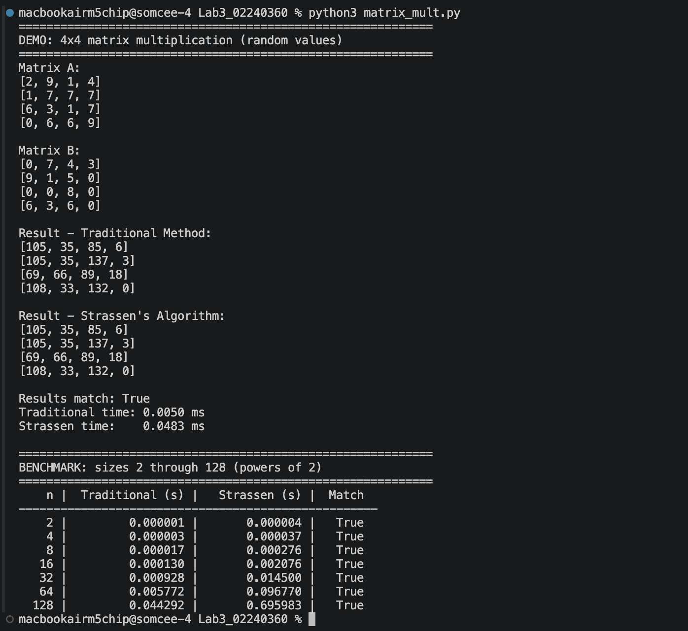
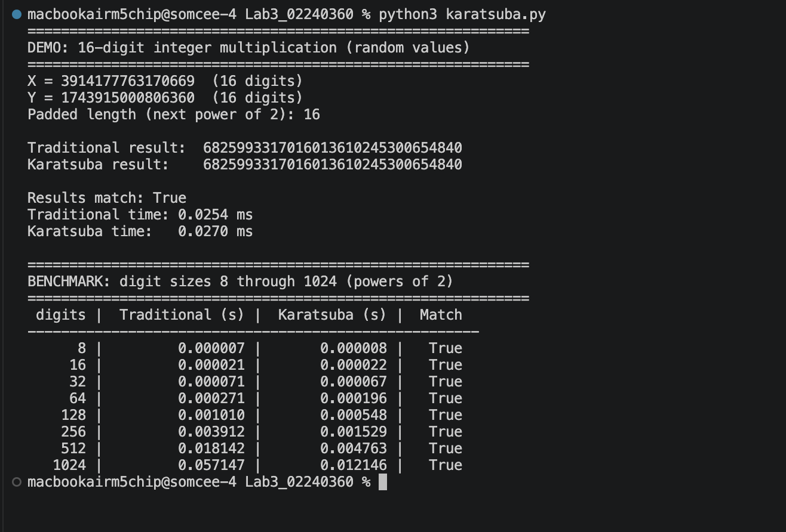
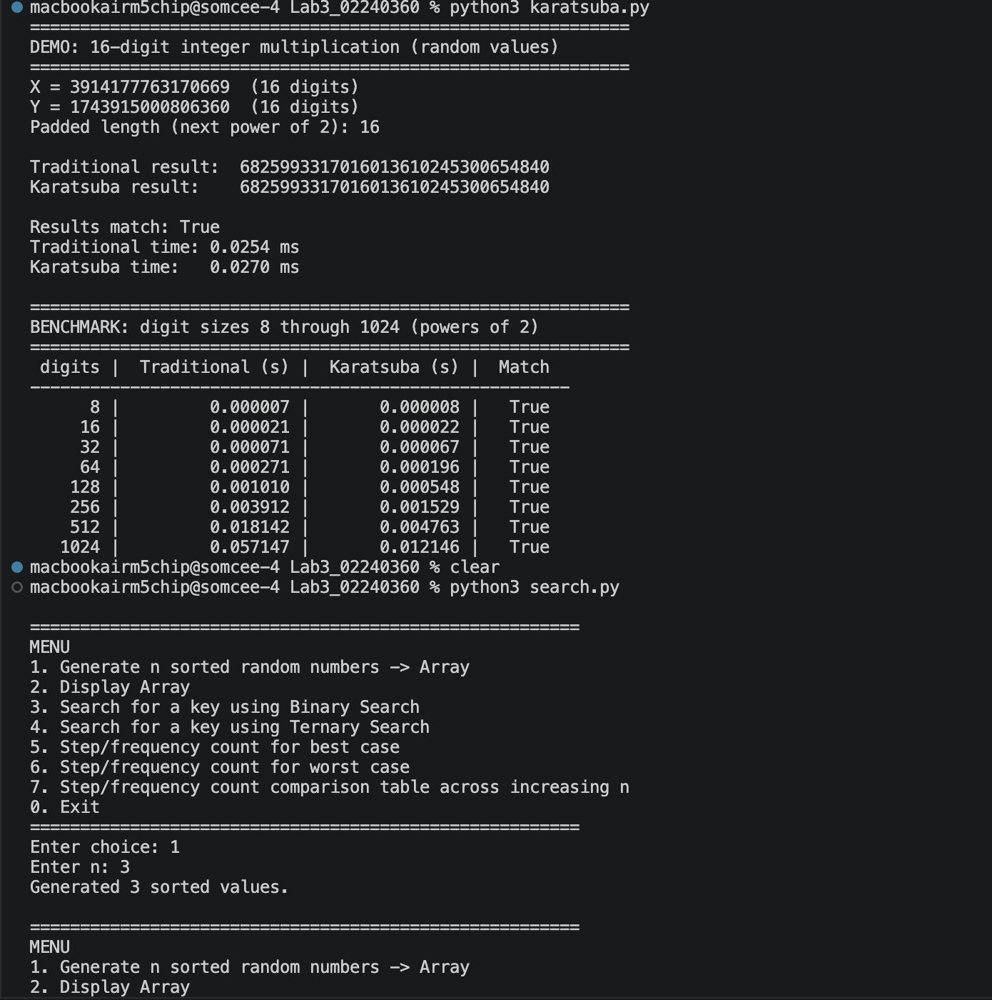
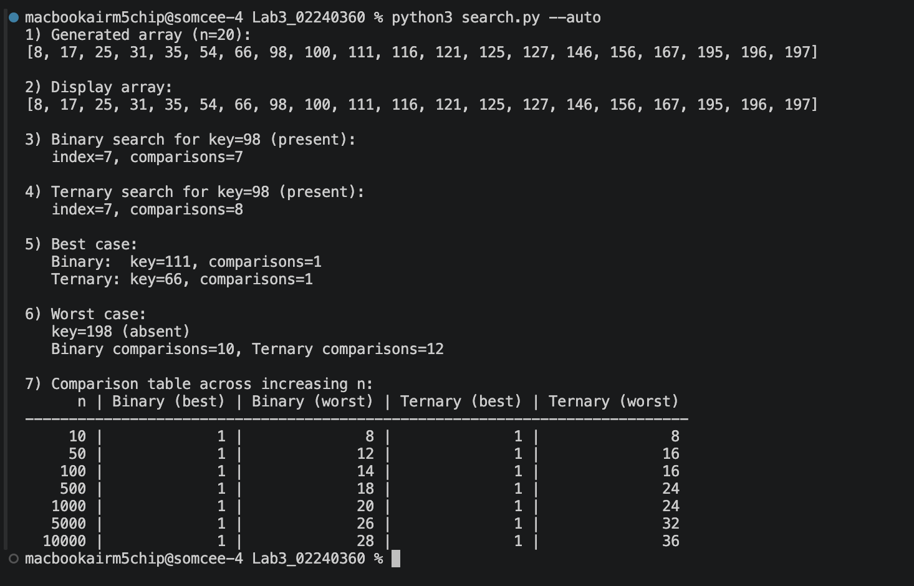

# Lab 3 Report

**Divide-and-Conquer Algorithms: Matrix Multiplication, Large Integer Multiplication, and Search**
**Student Number:** 02240360

---

## Q1: Matrix Multiplication — Strassen's vs Traditional

### Summary
Implemented and compared traditional O(n³) matrix multiplication with Strassen’s divide-and-conquer O(n^2.807) algorithm for random n×n integer matrices (values 0–9), with n = 2, 4, 8, …, 128. Strassen uses 7 recursive multiplications per split and matched the traditional result exactly for every tested size. However, in pure Python, the traditional method was faster at all tested sizes. Strassen’s lower asymptotic complexity did not overcome its larger constant overhead from deep recursion to 1×1, many function calls and list allocations, and extra matrix additions/subtractions. Its practical crossover point is typically hundreds to thousands—higher still in Python—so n ≤ 128 is too small. This confirms why real libraries usually use traditional multiplication below a cutoff and Strassen only for larger matrices.

### Output Screenshot

---

## Q2: Karatsuba's Algorithm for Large Integer Multiplication

### Summary
Compared Traditional grade-school multiplication (O(n²)) with Karatsuba’s divide-and-conquer algorithm (O(n^1.585)) for large integers represented as digit strings, padded to equal power-of-2 length. Traditional multiplication works digit-by-digit with carry propagation; Karatsuba splits each number into high/low halves and reduces 4 sub-multiplications to 3 using z0 = low×low, z2 = high×high, and z1 = (low+high)×(low+high) − z2 − z0, then recombines them. Results matched exactly for every tested size from 8 to 1024 digits.

At small sizes (8–64 digits), Traditional was slightly faster because Karatsuba’s recursion and extra additions/subtractions add overhead. The crossover occurred around 128 digits, after which Karatsuba pulled ahead, becoming roughly 4× faster by 1024 digits. This matches theory: Traditional is O(n²), while Karatsuba is O(n^log₂3) ≈ O(n^1.585). Unlike Strassen’s matrix algorithm, Karatsuba’s crossover is practically reachable because its base case is a single-digit multiply and it has fewer recursive levels and less per-split overhead.

### Output Screenshot

---

## Q3: Binary Search vs Ternary Search (Menu-Driven Program)

### Summary
Implemented a menu-driven program comparing Binary Search and Ternary Search on sorted arrays using comparison counts. Binary Search follows T(n) = T(n/2) + O(1) → O(log₂ n), with ≤2 comparisons per level. Ternary Search follows T(n) = T(n/3) + O(1) → O(log₃ n), with ≤4 comparisons per level. Both were correct; best case finds the key on the first probe, worst case is a missing key.

Binary Search used fewer or equal comparisons in all tests, and the gap grew with n. Ternary Search has fewer levels (log₃2 ≈ 0.631), but does about twice the work per level: 4·log₃ n ≈ 2.52·log₂ n. So Binary Search remains more efficient for single-key search.

### Menu
1. Generate n sorted random numbers → Array
2. Display Array
3. Search for a key using Binary Search
4. Search for a key using Ternary Search
5. Step/frequency count for best case
6. Step/frequency count for worst case
7. Step/frequency count comparison table across increasing n

### Output Screenshot

---

